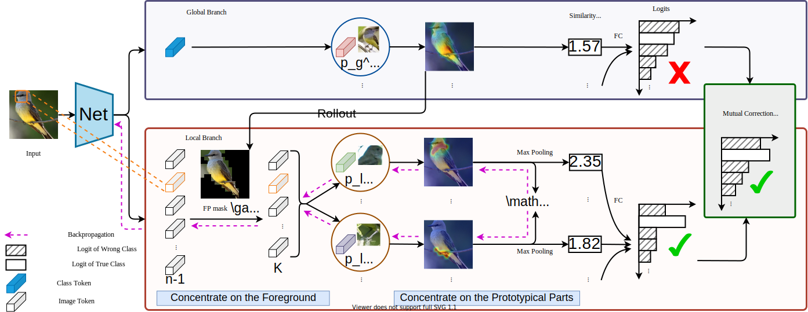

# ProtoPFormer

## Introduction

This is the official implementation of paper **"ProtoPFormer: Concentrating on Prototypical Parts in Vision Transformers for
Interpretable Image Recognition"**. [**[Paper](https://arxiv.org/abs/2208.10431)**]

The overview of ProtoPFormer is as below:



## Updates

* **09/18/2022** Modify the default backbone to be `deit_tiny_patch16_224`.
* **08/29/2022** The citation of our paper has been added.
* **08/23/2022** Code has been uploaded.

## Dataset
The CUB dataset is downloaded from `https://www.vision.caltech.edu/datasets/cub_200_2011/`.

The Stanford Dogs dataset is downloaded from `http://vision.stanford.edu/aditya86/ImageNetDogs/`.

The Stanford Cars dataset is downloaded from `http://ai.stanford.edu/~jkrause/cars/car_dataset.html`.

Decompress them and place them in the `datasets/` folder as follows:

```
datasets
--CUB_200_2011
    |--attributes
    |--images
    |--parts
    |...
--stanford_dogs
    |--Annotation
    |--Images
    |...
--stanford_cars
    |--cars_test
    |--cars_train
    |...
```

## Usage

First clone the repository locally:

```
git clone git@github.com:zju-vipa/ProtoPFormer.git
```

Then install the requried packages as below:

```
pytorch==1.8.1
torchvision==0.9.1
pillow==9.1.1
timm==0.5.4
opencv-python==4.6.0.66
tensorboard==2.9.1
scipy==1.8.1
pandas==1.4.3
matplotlib==3.5.2
scikit-learn==1.1.1
```

Newer versions of these packages may work.

## Train

The training scripts for CUB, Dogs and Cars are `scripts/train_cub.sh`, `scripts/train_dogs.sh`, `scripts/train_car.sh`, respectively.

The format instruction of training is as below:

```
sh scripts/train_cub.sh $backbone $batch_size $num_gpus
```

Here, `$backbone` is chosen from [`deit_tiny_patch16_224`, `deit_small_patch16_224`, `cait_xxs24_224`], `$batch_size` denotes batch size, and `$num_gpus` denotes the number of gpus for training. An example for training a ProtoPFormer of backbone `deit_tiny_patch16_224` on CUB with batch size 64 and 2 gpus is as below:

```
sh scripts/train_cub.sh deit_tiny_patch16_224 64 2
```

## Visualize

The format instruction of training is as below:

```
sh scripts/visualize.sh $backbone $data_set $output_dir $use_gauss $modeldir $modelfile
```

An example for visualizing a ProtoPFormer of backbone `deit_tiny_patch16_224` on CUB with a checkpoint file `output_cosine/CUB2011U/deit_tiny_patch16_224/1028--adamw-0.05-200-protopformer/checkpoints/epoch-best.pth` is as below:

```
sh scripts/visualize.sh deit_tiny_patch16_224 \
CUB2011U \
output_view \
False \
output_cosine/CUB2011U/deit_tiny_patch16_224/1028--adamw-0.05-200-protopformer/checkpoints \
epoch-best.pth
```

Noted that `$use_gauss` denotes whether visualizing gaussian shape, it will be much slower if `$use_gauss` is True.

## Citation
If you find our code is helpful for your research, please cite:

```
@article{xue2022protopformer,
  title={ProtoPFormer: Concentrating on Prototypical Parts in Vision Transformers for Interpretable Image Recognition},
  author={Xue, Mengqi and Huang, Qihan and Zhang, Haofei and Cheng, Lechao and Song, Jie and Wu, Minghui and Song, Mingli},
  journal={arXiv preprint arXiv:2208.10431},
  year={2022}
}
```


## Statement

This project is for research purpose only. For any other questions please contact `mqxue@zju.edu.cn`.